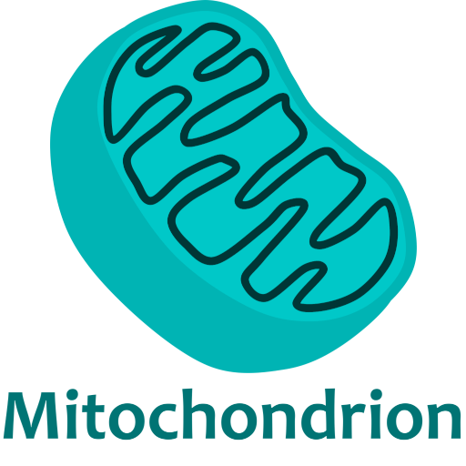

# Mitochondrion Engine - *The Powerhouse of the Game*


<p align="center"></p>

## 3D Voxel Game Engine
Mitochondrion Engine is a 3D game engine for windows that specializes in voxel rendering. However it has plenty of ofther features to supplement the creation of a voxel game. Thanks to the voxel tools that it will provide, users don't need to spend time figuring out how to build optimal meshes for voxels or how minimize draw calls. Everything is ready and optimized. In just a few simple steps, you can have a vast world made up of cubes that is ready for anyone to explore!

## Downloading

### Binaries

There are currently no availible binaries to download. Once some are availible, this section will be updated.

### Source
To download from source, open a console where you want to clone the files to and use the following command:

```git clone --recursive https://github.com/Alex-Sindledecker/Mitochondrion_Engine/```

Make sure to include the *--recursive* so all submodules are downloaded along side the main repo
